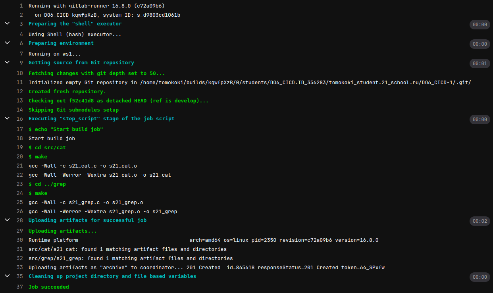

# Basic CI/CD by tomokoki

Разработка простого **CI/CD** для проекта *SimpleBashUtils*. Сборка, тестирование, развертывание.


### Part 1. Настройка **gitlab-runner**

##### Подними виртуальную машину *Ubuntu Server 22.04 LTS*.

Убедимся, что на виртуальной машине стоит нужная версия __Ubuntu__:


Также сразу установим необходимые нам инструменты следующей командой:

`sudo apt install gcc make clang-format`

##### Скачай и установи на виртуальную машину **gitlab-runner**.

Для установки необходимо выполнить следующие команды:

```sh
curl -L "https://packages.gitlab.com/install/repositories/runner/gitlab-runner/script.deb.sh" | sudo bash
sudo apt-get update
sudo apt-get install gitlab-runner
```

##### Запусти **gitlab-runner** и зарегистрируй его для использования в текущем проекте (*DO6_CICD*).

Запустим gitlab-runner:
`sudo gitlab-runner start`

Для регистрации выполняем команду `sudo gitlab-runner register` и указываем следующие данные:
- URL: берем с репозитория
- Токен: берем с репозитория 
- Название: __DO6_CICD__
- Теги: __test__  (можно не указывать)
- Опции: пропускаем
- Исполнитель: __shell__


### Part 2. Сборка

#### Напиши этап для **CI** по сборке приложений из проекта *C2_SimpleBashUtils*.

Обычно, процесс CI/CD включает следующие шаги:
- Сборка пакета *(build)*;
- Тестирование *(test)*;
- Доставка *(delivery)*;
- Развертывание *(deploy)*;

##### В файле _gitlab-ci.yml_ добавь этап запуска сборки через мейк файл из проекта C2.

Для сборки нужно подготовить yml файл. Он содержит в себе следующие блоки:
- __stages__ — описание стадий нашего пайплайна;
- __task_name__ - имя задачи. Внутри задачи мы указываем:
  - __stage__ - стадия, к которой относится наше задание.
  - __script__ - набор скриптов для выполнения;
  - __artifacts__ - артефакты представляют из себя промежуточные сборки или файлы, которые могут передаваться от одного этапа — другому;

Содержимое файла __gitlab-ci.yml__:


Запушим наш файл в репозиторий. Pipeline тригерится на пуш, поэтому сразу запускается. Проверим результат в репозитории:


Стейджи прошли успешно, можно посмотреть вывод работы:



##### Файлы, полученные после сборки (артефакты), сохрани в произвольную директорию со сроком хранения 30 дней.

Для сохранения файлов в блоке __aritifacts__ нужно указать:
- __paths__ - пути к файлам, которые нужно сохранить;
- __expire_in__ - этот параметр позволяет задать время, которое файлы будут храниться;

Проверим, что файлы сохранились:


Скачаем архив, в нем содержатся исполяемые файлы для __cat__ и __grep__ соотвественно:


### Part 3. Тест кодстайла

#### Напиши этап для **CI**, который запускает скрипт кодстайла (*clang-format*).

Содержание __gitlab-ci.yml__ файла с новым stage:


Сначала мы проверяем код на стиль. После этого выполняем форматирование и проверяем, осталось ли содержимое файлов таким же, как на git. Если это не так, завершаем процесс.

Pipeline:


Вывод самой работы:


##### Если кодстайл не прошел, то «зафейли» пайплайн. В пайплайне отобрази вывод утилиты *clang-format*.

Изменим содержимое файла `s21_grep.c`, чтобы он не соотвествовал code-style и запушим изменения в git. 

Pipeline:


Вывод самой работы:


### Part 4. Интеграционные тесты

#### Напиши этап для **CI**, который запускает твои интеграционные тесты из того же проекта.  Запусти этот этап автоматически только при условии, если сборка и тест кодстайла прошли успешно.Если тесты не прошли, то «зафейли» пайплайн. В пайплайне отобрази вывод, что интеграционные тесты успешно прошли / провалились.

Для данного этапа в тестовые скрипты был добавлен следующий код:

```bash
if [ $FAIL != 0 ]
then
    exit 1
else
    exit 0
fi
```
Данный код, если кол-во failed тестов > 0 вернет 1, в ином случае 0. 

Содержимое __gitlab-ci.yml__ файла:

 

- __when__ - опция, которая говорит о том, при каком условии stage будет запущен. В нашем случае - __on_success__, то есть либо все предыдущие этапы прошли успешно, либо у них есть опция __allow_failure: true__ (Вообще, если у нас случай on_success, то when можно не указывать, т.к. он стоит по дефолту);

В данной строчке мы отлавливаем код завершения, и если это 1 (failed), то завершаем процесс с кодом 1:

```bash
if [ $? -ne 0 ]; then exit 1; fi 
```
Pipeline:


Работа:


Теперь запушим в репозиторий тест, который зафейлится. 

Pipeline:


Работа:


Также проверим, что этап не будет выполняться, если не отработали предыдущие. Снова изменим стиль кода. Pipeline:


### Part 5. Этап деплоя

##### Подними вторую виртуальную машину *Ubuntu Server 22.04 LTS*.

Проверим, что на машине стоит нужная версия:


Сразу настроим внутреннюю сеть для __ws1__ и __ws2__.

Конфигурация __yaml__ для __ws1__:


Конфигурация __yaml__ для __ws2__:


Для каждой машины задаем статические IP и маршрут до другого устройства.

#### Напиши этап для **CD**, который «разворачивает» проект на другой виртуальной машине. Запусти этот этап вручную при условии, что все предыдущие этапы прошли успешно.

Содержимое файла __gitlab-ci.yml__:


- Здесь мы задали для __when__ значение __manual__, это необходимо для возможности запуска в ручную.

##### Напиши bash-скрипт, который при помощи **ssh** и **scp** копирует файлы, полученные после сборки (артефакты), в директорию */usr/local/bin* второй виртуальной машины.

Содержимое файла __deploy.sh__:


- __scp (Secure CoPy)__ — утилита для безопасного копирования данных между Linux-системами по протоколу SSH. 

Для того, чтобы scp смог отработать корректно, необходимо сделать следующее:
- На первой машины сгенерировать ssh-ключ (если до этого он не был сгенерирован) командой: `ssh-keygen`
- Затем с помощью команды `ssh-copy-id user@ip_address` установим открытый ключ публичного шифрования в файл авторизации на второй машине. Мы это делаем для того, чтобы использовать авторизацию по ключу, вместо ввода пароля.
- И на второй машине также нужно выдать права пользователю на доступ к папке /usr/local/bin. Выполним это с помощью команды `chown -R user_name /usr/local/bin/`
- Если возникают проблемы на запуске, значит надо посмотреть от какого пользователя выполняются script на первой машине (можно чекнуть с помощью `whoami`). По дефолту этот пользователь - gitlab-runner. Но у меня этим пользователем оказался __root__, поэтому второй пункт надо выполнить от него. _(Для смены пользователя `su - user_name`, для смены пароля `sudo passwd user_name`)_
-  
##### В файле _gitlab-ci.yml_ добавь этап запуска написанного скрипта.В случае ошибки «зафейли» пайплайн.

Благодаря конструкции, которая подробнее была описана в 4 парте, по окончанию работы, скрипт возвращает код _(0 или 1)_. Взависимости от него, у нас пайплайн либо фейлится, либо нет.

Протестируем работу скрипта.

После того, как прошли основные этапы, этап с деплоем ожидает ручного запуска:


Запустим стейдж и проверим, что он выполнился успешно:


Зайдем на вторую машину, и проверим, что на ней появились файлы и они запускаются:

