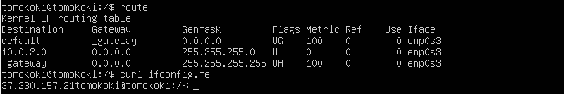
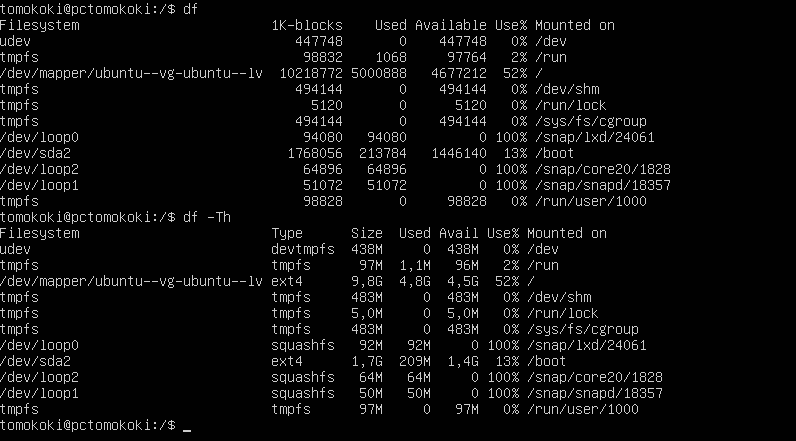

## Part 1. Установка ОС

Установка Ubuntu версии 20.04:

Для проверки версии посмотрим вывод команды `cat /etc/issue`:

## Part 2. Создание пользователя

- Для добавления нового пользователя используем команду `sudo adduser имя_пользователя`;
- Также добавим его в группу __`adm`__ при помощи команды `sudo adduser имя_пользователя adm`;

- Проверим результат выполнения команд при помощи команды `cat /etc/passwd`:

## Part 3. Настройка сети ОС

- Измненим hostname при помощи команды `sudo hostname название` на __user-1__. Сразу же проверим результат при помощи команды `hostname`:

- Проверим текущую временную зону при помощи команды `timedatectl`:

- Поставим местную временную зону (Москва) при помощи команды `sudo timedactl set-timezone Europe/Moscow`. Проверим изменения предыдущей командой:

- Названия сетевых интерфейсов:

- __lo__ - виртуальный интерфейс, используется по умолчанию в любом Linux и нужен для отладки сетевых программ и запуска серверных приложений на локальной машине.

__DHCP__:

- DHCP - Dynamic Host Configuration Protocol. Сетевой протокол, позволяющий сетевым устройствам автоматически получать IP-адрес и другие параметры, необходимые для работы в сети TCP/IP.

- Выведем IP устройства при помощи команды `ip a`:

- Внешний, внутренний IP шлюза выведем с помощью команд `route`, `curl ifconfig.me`:

- Просмотрим и изменим файл конфигураци DHCP командой `vim /etc/netplan/имя_файла.yaml`

- В поле __dhcp4__ обязательно ставим __false__, в __addresses__ пропишем наш статический IP, в gateway4 вписываем IP шлюза, в nameservers пропишем DNS. Результат после reboot представлен ниже:
  

- Попробуем пропинговать хосты 1.1.1.1 и яндекса. Результат представлен ниже:

## Part 4. Обновление ОС

- Для обновления системы потребутеся ввести две команды - `sudo apt update` для обновления пакетов и `sudo apt upgrade` для их установки. Просмотрим результат после обновления всех пакетов:

## Part 5. Использование команды **sudo**

 __Sudo__ (substitute user and do — дословно «подменить пользователя и выполнить») — это выполнение команды от имени другого пользователя, обычно от root. 

- Добавим пользователю __user_tolya__, созданному ранее, права sudo. Для этого используем команду `sudo usermod -aG sudo user_tolya`, где опции __-aG__ - работают только парно и нужны для добавления пользователя в одну или несколько доп групп. Также можем сразу проверить результат добавления в группу при помощи команды `getent group имя_группы`;
- Для смены пользователя используем команду `su имя_пользователя`. Здесь же изменим hostname при помощи команды `sudo hostname set-hostname название` и сразу проверим его результатом выполнения команды `hostname`: 

## Part 6. Установка и настройка службы времени

- Для синхронизации установим протокол синхронизации по сети __NTP__ командой `sudo apt-get install ntp`
- Затем воспользуемся командой `sudo timedatectl set-ntp on` для синхронизации времени;
- Результат вывода команды `timedatectl show` представлен ниже:

## Part 7. Установка и использование текстовых редакторов 

Для данного задания были выбраны следующие редакторы: __VIM, NANO, MCEDIT__.

__VIM__:

- Создадим файл __test_vim.txt__ командой `vim test_vim.txt`. Для ввода нужно нажать кнопку __i__, после ввода для выхода с сохранением нужно нажать `ESC` и ввести `:wq`. Результат представлен ниже:

- Откроем файл снова и введем строку "21 School 21". Для закрытия файла без изменений можно ввести `:q!`. Резульат ниже:

- Отредактируем файл снова и найдем подстроку __21__ командой `/21`. Результат представлен ниже: 

- Для замены слова нужно ввести следующую команду - `:s/что_менять/на_что_менять`. Результат выполнения представлен ниже:

__NANO__:

- Создадим файл __test_nano.txt__ командой `nano test_nano.txt`. Для ввода нужно нажать кнопку __i__, после ввода для выхода с сохранением нужно нажать `Ctrl + X` и ввести __Y__. Результат представлен ниже:

- Откроем файл снова и введем строку "21 School 21". Для закрытия файла без изменений нужно нажать `Ctrl + X` и нажать __N__. Резульат ниже:

- Отредактируем файл снова и найдем подстроку __21__ нажатием `Ctrl + W` и введем в поле искомое выражение. Результат представлен ниже: 

- Для замены слова нужно ввести следующую команду - `Ctrl + R` и введем строку, на которую будем менять найденное выражение. Результат выполнения представлен ниже:

__MCEDIT__:

- Создадим файл __test_mcedit.txt__ командой `mcedit test_mcedit.txt`. Для ввода нужно нажать кнопку __i__, после ввода для выхода с сохранением нужно нажать `F10` и выбрать __Yes__. Результат представлен ниже:

- Откроем файл снова и введем строку "21 School 21". Для закрытия файла без изменений нужно нажать `F10` и вырать __NO__. Резульат ниже:

- Отредактируем файл снова и найдем подстроку __21__ нажатием `F7` и введем в поле искомое выражение и выберем сколько искать. Результат представлен ниже: 

- Для замены слова нужно ввести следующую команду - `F4` и введем строку, на которую будем менять найденное выражение. Результат выполнения представлен ниже:

## Part 8. Установка и базовая настройка сервиса **SSHD**

__SSHD__ - сетевой протокол прикладного уровня, который позволяет управлять операционной системой и выполнять функцию тунеллирования TCP-соединения. Работа SSH построена на взаимодействии 2-х компонентов: SSH-сервера и SSH-клиента.

- Для установки используем команды `sudo apt-get install ssh`, `sudo apt install openssh-server`. Для добавления пакета SSH-сервера в автозагрузку используем команду `sudo systemctl enable sshd`:

- Для изменения порта с помощью __VIM__ откроем файл `vim /etc/ssh/sshd_config` и впишем значение __2022__:

- Проверка с помощью `netstat -tan`:

  Значение ключей и полей для команды, использованной выше:

- Ключ `t` - показывает только TCP соединения
- Ключ `a` - показывает все сокеты
- Ключ `n` - вывод адреса в числовом формате

- __Proto__: Показывает тип протокола сетевого соединения.

- __Recv-Q__: Показывает количество пакетов данных, которые находятся в очереди на прием на сокете.

- __Send-Q__: Показывает количество пакетов данных, находящихся в очереди на отправку сокета.

- __Local Address__: Показывает локальный адрес (IP-адрес и порт) для данного сокета.

- __Foreign Address__: Показывает удаленный адрес (IP-адрес и порт), к которому установлено соединение.

- __State__: Показывает текущее состояние сетевого соединения.

- __0.0.0.0__: Во внешнем адресе - никто не подключался, в локальном - служба ожидает входящие сетевые соединения. 

 Поиск __SSH__:

- Команда `ps` выводит список текущих процессов на вашем сервере в виде таблицы, с которой можно удобно работать: сортировать, изменять количество колонок и прочие
- Ключ `a` - выбор всех процессов
- Ключ `u` - выбор всех процессов пользователя
- Ключ `x` - выбор всех процессов с комбинацией с `a`
- `grep ssh` - поиск процесса с названием `ssh`

## Part 9. Установка и использование утилит **top**, **htop**

- __Утилита top__ - утилита, которая позволяет отслеживать процессы и использование системных ресурсов в Linux.
- Запустим утилиту командой `top`:

- Uptime - время с последней перезагрузки - 7 минут
- Количество авторизованных пользователей - 1
- Общая загрузка системы - 0 (минута, 5 минут, 15 минут)
- Загрузка CPU - 0
- Загрузка памяти 965.1Mb всего, 473.8Mb - свободно, 142.8Mb используется, 348.6Mb используется для кэша/буфера
- PID `1024` использует наибольшее процессерное время (по дефолту)

Вывод `top` с сортировкой по памяти `Shift + M`:

- PID `642` использует наибольшее количество памяти

__Утилита htop__ - аналогична top, является ее альтернативой.

- Стандартный вывод `htop`:

- Вывод `htop` с сортировкой по __PID__:

- Вывод `htop` с сортировкой по __CPU__:

- Вывод `htop` с сортировкой по __MEM__:

- Вывод `htop` с сортировкой по __TIME__:

- Вывод `htop` отфильтрованному по по `sshd`:

- Вывод `htop` с процессом `syslog`:

- Настройка вывода `htop`:
  

- Результат настройки `htop` с выводом __hostname__, __clock__, __uptime__:

## Part 10. Использование утилиты **fdisk**

__fdisk__ - утилита для управления разделами жесткого диска.
- Вывод команды `fdisk -l`, -l инициализирует таблицу слайсов:

- Название - __sda__
- Размер диска - __15 GB__
- Количество секторов - __31457280__

## Part 11. Использование утилиты **df** 

Утилита __df__ - показывает список всех файловых систем по именам устройств, сообщает их размер, занятое и свободное пространство и точки монтирования.

- Выполнение команд `df` и `df -Th`:

- Отчет по команде `df`:

    - Размер раздела - __10218772 Kb__ (около 10Gb)
    - Размер занятого пространства - __5000888 Kb__ (около 5Gb)
    - Размер свободного пространства - __4677212 Kb__ (около 4,6Gb)
    - Процент использования - __52__

- Отчет по команде `df -Th`, выводит информацию в человекочитаемом виде:

    - Размер раздела - __9,8 Gb__
    - Размер занятого пространства - __4,8 Gb__
    - Размер свободного пространства - __4,5 Gb__
    - Процент использования - __52__

## Part 12. Использование утилиты **du**

- Вывод размеров папок __home, var, и всего содержимого var/log__ в KB:

## Part 13. Установка и использование утилиты **ncdu**

- Установка __ncdu__: `sudo apt install ncdu`

- Размер папок __/home /var, /var/log__:

## Part 14. Работа с системными журналами

__/var/log/dmesg__ - содержит сообщения, полученные от ядра. Регистрирует много сообщений еще на этапе загрузки, в них отображается информация об аппаратных устройствах, которые инициализируются в процессе загрузки.

- Просмотр __/var/log/dmesg__:

__/var/log/syslog__ - глобальный системный журнал. В нем мы можем найти события, произошедшие с момента запуска системы от различных компонентов ОС — ядра, служб, устройств и т. д.

- Просмотр __/var/log/syslog__:

__/var/log/auth.log__ - содержит информацию об авторизации пользователей в системе, включая пользовательские логины и механизмы аутентификации, которые были использованы.

- Просмотр __/var/log/auth.log__:

- Время последней авторизации - `17:49:52`
- Имя пользователя - `tomokoki`

- Перезапуск службы `ssh`:

    - `sudo systemctl restart sshd` - команда для перезапуска службы

## Part 15. Использование планировщика заданий **CRON**

__CRON__ - программа-демон, предназначенная для выполнения заданий в определенное время, или через определенные промежутки времени. Для редактирования заданий используется утилита crontab .

- Для добавления задачи нужно прописать команду `crontab -e` и выбрать подходящиий текстовый редактор. Затем пропишем саму задачу в файле: `*/2 * * * * uptime`. 

- `*/2` - говорит о том, что команда будет выполняться каждые две минуты;
- остальные `*` отвечают за час, день, месяц, год;
- далее идет сама команда для выполнения `uptime`
- Посмотрим результат выполнения задачи в  `log`:

- Удалим команды для __CRON__ с помощью команды `crontab -r` и проверим текущий список задач командой `crontab -l`:

