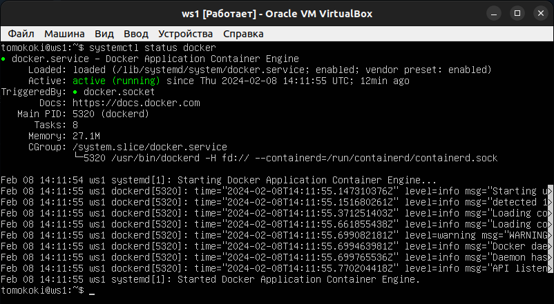

# Simple Docker by tomokoki

Введение в докер. Разработка простого докер-образа для собственного сервера.

## Part 1. Готовый докер

Для начала нужно установить __docker__:
1. Перед установкой нужно обязательно установить дополнительно 4 пакета:
   - curl — необходим для работы с веб-ресурсами;
   - software-properties-common — пакет для управления ПО с помощью скриптов;
   - ca-certificates — содержит информацию о центрах сертификации;
   - apt-transport-https — необходим для передачи данных по протоколу HTTPS.
Для установки выполнить команды:
   `sudo apt update`
   `sudo apt upgrade`
   `sudo apt install <имя_пакета>`

2. Далее импортируем __GPG-ключ__. GPG-ключ нужен для верификации подписей ПО. Он понадобится для добавления репозитория докера в локальный список. Импортируем GPG-ключ следующей командой:
   `curl -fsSL https://download.docker.com/linux/ubuntu/gpg`
   `sudo apt-key add docker.gpg`

3. Теперь добавляем __репозиторий докера__ в источник APT: Добавим репозиторий для нашей версии Ubuntu, которая называется `«Focal»` (20.04). Для других версий ОС нужно использовать их кодовые имена. Выполняем команду:
   `sudo add-apt-repository "deb [arch=amd64] https://download.docker.com/linux/ubuntu focal stable"`

4. Снова обновим индексы пакетов: 
   `sudo apt update` 

5. Убедимся, что установка будет выполняться из репозитория Docker, а не из репозитория Ubuntu по умолчанию: 
   `apt-cache policy docker-ce`

6. Установим докер следующей командой:
   `sudo apt install docker-ce`

7. Наконец, проверим что Docker активен и запущен:
   `sudo systemctl status docker`



##### Возьми официальный докер-образ с **nginx** и выкачай его при помощи `docker pull`.

Выполним команду `docker pull nginx`:


##### Проверь наличие докер-образа через `docker images`.

Чтобы увидеть, какие изображения присутствуют локально, выполним команду `docker images`:


##### Запусти докер-образ через `docker run -d [image_id|repository]`.

Запуск докер-образа:


__-d__ - запускает контейнер в фоновом режиме и выводит ID контейнера 

##### Проверь, что образ запустился через `docker ps`.

Результат работы команды:


__В вывод команды попадают следующие параметры:__

- __ID__ — то есть кодовое значение конкретного контейнера;
- __IMAGE__ — образ, используемый контейнером;
- __COMMAND__ — список команд, которые должны выполняться сразу после запуска;
- __CREATED__ — статус и время, когда контейнер бы создан;
- __STATUS__ — текущее состояние – включен ли и время работы с последнего запуска. Тут может отображаться код выхода и время, когда он произошел;
- __PORTS__ — порты, используемые контейнером из списка;
- __NAMES__ — более понятные в сравнении с ID имена, которые можно точно так же использовать для исполнения команд или поиска;

##### Посмотри информацию о контейнере через `docker inspect [container_id|container_name]`. По выводу команды определи и помести в отчёт размер контейнера, список замапленных портов и ip контейнера.
Данная команда отображает подробную информацию из Docker после обращения к конкретному контейнеру. По дефолту выводятся значения в формате _JSON_.

В нашем случае к контейнеру можно обратиться через
- __ID__: 8586670bf8f1
- __NAMES__: zealous_goldwasser

Выполним команду `docker inspect --size zealous_goldwasser > inspect.tmp`. Флаг `--size` используется для добавления информации о размере. __Информация о портах и ip:__


__Размер контейнера:__


Для проверки IP контейнера выполним следующую команду:

`docker inspect --format '{{ .NetworkSettings.IPAddress }}' zealous_goldwasser`


Флаг `--format` позволяет достать данные в нужном нам виде. 

##### Останови докер образ через `docker stop [container_id|container_name]`. Проверь, что образ остановился через `docker ps`.

Остановим докер образ командой `docker stop zealous_goldwasser` и выведем информацию о запущенных образах:


##### Запусти докер с портами 80 и 443 в контейнере, замапленными на такие же порты на локальной машине, через команду *run*.

Выполним команду `sudo docker run -d -p 80:80 -p 443:443 nginx`


__-p__ - указывает на привязку портов, где первый число перед двоеточием - это порт на хосте, а второе число после двоеточия - это порт внутри контейнера. 

##### Проверь, что в браузере по адресу *localhost:80* доступна стартовая страница **nginx**.


Затем выполним команду: `curl localhost:80`


##### Перезапусти докер контейнер через `docker restart [container_id|container_name]`. Проверь любым способом, что контейнер запустился.

Узнаем ID контейнера, по нему выполним рестарт, а затем снова просмотрим список запущенных образов:


## Part 2. Операции с контейнером

##### Прочитай конфигурационный файл *nginx.conf* внутри докер контейнера через команду *exec*.

__docker exec__ - используется для выполнения произвольных команд внутри Docker контейнеров.

__--interactive / -i__ - сохраняет STDIN открытым, даже если он не подключен.

__--tty / -t__	- выделение псевдо-TTY

Для начала выполним команду `sudo docker exec -it <id> find -name "nginx.conf"`, чтобы найти путь до файла __nginx.conf__. Теперь можем выполнить команду `sudo docker exec -it <id> cat путь_до_файла`. Результат выполнения команд представлен ниже:


##### Создай на локальной машине файл *nginx.conf*. Настрой в нем по пути */status* отдачу страницы статуса сервера **nginx**.

Чтобы настроить отдачу страницы статуса сервера Nginx по пути `/status`, нужно добавить блок location в файл nginx.conf. Этот блок должен находиться внутри блока server, чтобы он был частью конфигурации сервера. Конфигурация __файла nginx.conf__ представлена ниже:


##### Скопируй созданный файл *nginx.conf* внутрь докер-образа через команду `docker cp`.

Данной командой можно копировать как внутрь образа, так и из него. Для этого перед файлом, находящимся в образе нужно прописать __ID контейнера__:


##### Перезапусти **nginx** внутри докер-образа через команду *exec*. Проверь, что по адресу *localhost:80/status* отдается страничка со статусом сервера **nginx**.

Перед перезапуском проверим nginx.conf на наличие ошибок с помощью команды `nginx -t`. Далее перезагрузим nginx, чтобы применить изменения командой `nginx -s restart`. Проверим, что лежит на localhost:80/status:


##### Экспортируй контейнер в файл *container.tar* через команду *export*.


__--output / -o__ - путь к файлу, куда выполнить запись.

##### Останови контейнер.


##### Удали образ через `docker rmi [image_id|repository]`, не удаляя перед этим контейнеры.


##### Удали остановленный контейнер.


##### Импортируй контейнер обратно через команду *import*.

У нашего экспортированного контейнера отсутсвует __ENRTYPOINT__. __ENTRYPOINT в Dockerfile__ - определяет команду, которая будет выполняться при старте контейнера. Он позволяет настроить контейнер так, чтобы он работал как исполняемый файл. Формат: `CMD ["executable","param1","param2"]`. Поэтому мы сами на импорте добавляем ENTRYPOINT при помощи флага __-c__. Данные мы можем получить из dockerfile nginx. Итоговая команда для импорта контейнера представлена ниже:


##### Запусти импортированный контейнер.


##### Проверь, что по адресу *localhost:80/status* отдается страничка со статусом сервера **nginx**.


## Part 3. Мини веб-сервер

##### Напиши мини-сервер на **C** и **FastCgi**, который будет возвращать простейшую страничку с надписью `Hello World!`.

Для начала необходимо установить библиотеку __FastCGI__. Для этого введем следующую команду: `sudo apt-get install libfcgi-dev`

Далее создадим файл __my_server.c__. Код файла:

```c
#include <fcgi_stdio.h>
#include <stdlib.h>

int main() {
    while(FCGI_Accept() >=  0) { // Главный цикл обработки запросов
        printf("Content-Type: text/html\r\n" // Заголовки HTTP
               "\r\n");
        printf("<html><body>"
               "<h1>Hello World!</h1>"
               "</body></html>\n"); // HTML-страница
    }
    return  0;
}
```

Сам файл:


##### Запусти написанный мини-сервер через *spawn-fcgi* на порту 8080.

Для начала нужно обязательно установить __библиотеку__ и компилятор __gcc__:

`sudo apt install spawn-fcgi`

`sudo apt install gcc`

Скомпилируем файл, созданный ранее следующей командой: `gcc my_server.c -o my_server.fcgi -lfcgi`


Теперь запустим сервер на порту 8080:


##### Напиши свой *nginx.conf*, который будет проксировать все запросы с 81 порта на *127.0.0.1:8080*.

Изменим файл __nginx.conf__:


Далее обязательно сохраним изменения и перезагрузим nginx:


##### Проверь, что в браузере по *localhost:81* отдается написанная тобой страничка.


##### Положи файл *nginx.conf* по пути *./nginx/nginx.conf* (это понадобится позже).

## Part 4. Свой докер

#### Напиши свой докер-образ, который:
##### 1) собирает исходники мини сервера на FastCgi из [Части 3](#part-3-мини-веб-сервер);
##### 2) запускает его на 8080 порту;
##### 3) копирует внутрь образа написанный *./nginx/nginx.conf*;
##### 4) запускает **nginx**.

В файл __run.sh__ поместим все команды, необходимые для выполнения задания, описанного выше:


Создадим __Dockerfile__:


- __FROM__ - Задает базовый образ. Все последующие инструкции создают слои поверх родительского образа.
- __RUN__ - Выполняет команду внутри контейнера и сохраняет результат. RUN может исполнять конвейер команд с логическими операторами && и ||.
- __WORKDIR__ - Устанавливает рабочую директорию контейнера. Последующие инструкции CMD, RUN, ENTRYPOINT наследуют привязку к директории установленной WORKDIR.
- __COPY__ - Копирует файлы и папки из текущей директории, где находится пользователь в указанную директорию в контейнере.
- __CMD__ - Выполняет команду с указанными аргументами во время запуска контейнера.	CMD должна быть одна в конце Dockerfile. CMD может вызывать исполняемый файл — .sh. Аргументы docker run переопределяют CMD. Если в Dockerfile нет CMD, обязательно должна быть инструкция ENTRYPOINT.

##### Собери написанный докер-образ через `docker build` при этом указав имя и тег. Проверь через `docker images`, что все собралось корректно.


__-t__ - позволяет задать тег.

##### Запусти собранный докер-образ с маппингом 81 порта на 80 на локальной машине и маппингом папки *./nginx* внутрь контейнера по адресу, где лежат конфигурационные файлы **nginx**'а (см. [Часть 2](#part-2-операции-с-контейнером)).


__-p__ - маппинг портов
__-v__ - маппинг папки `(путь до папки/файла на локальной машине : путь до папки/файла в докере)`

##### Проверь, что по localhost:80 доступна страничка написанного мини сервера.


##### Допиши в *./nginx/nginx.conf* проксирование странички */status*, по которой надо отдавать статус сервера **nginx**.


##### Перезапусти докер-образ. Проверь, что теперь по *localhost:80/status* отдается страничка со статусом **nginx**


*Если всё сделано верно, то, после сохранения файла и перезапуска контейнера, конфигурационный файл внутри докер-образа должен обновиться самостоятельно без лишних действий*

## Part 5. **Dockle**

Для начала необходимо установить __Dockle__. Для этого выполним следующие действия:
- Установить __Homebrew__, инструкция есть на сайте `https://docs.brew.sh/Homebrew-on-Linux`;
- Теперь ставим сам Dockle:
```sh
brew untap goodwithtech/dockle # who use 0.1.16 or older version
brew install goodwithtech/r/dockle
```

##### Просканируй образ из предыдущего задания через `dockle [image_id|repository]`.


##### Исправь образ так, чтобы при проверке через **dockle** не было ошибок и предупреждений.

При проверке Dockle обнаружил 2 ошибки и 1 предупреждение. Исправим их:
- Ошибка __CIS-DI-0010: Do not store credential in environment variables/files__ - возникает, когда учетные данные хранятся в переменных окружения или файлах. Для исправления данной ошибки есть несколько вариантов:
   - Можне использовать опцию `--accept-key / -ak` при запуске Dockle, чтобы игнорировать определенные ключи, которые вы считаете безопасными. Эта команда сообщит Dockle, что вы осознаете риски, связанные с хранением учетных данных в переменных окружения, и что MY_SECRET_KEY является безопасным ключом, который можно проигнорировать. В данном случае я поступил именно так.
   - Сменить базовый образ с nginx. Например, можно было бы изменить его на ubuntu, а затем вручную установить nginx.
 - Ошибка __DKL-DI-0005: Clear apt-get caches__ - для ее решения необходимо удалить кеш списка пакетов.
 - Предупреждение __CIS-DI-0001: Create a user for the container__ - dockle просит использовать юзера, отличного от рута. Так и сделаем, поменяв пользователя на nginx. Также поменяем владельца файлов на нашего пользователя.

Измененный __Dockerfile__:


Измененный __run.sh__:


Соберем новый образ:


Проверим на ошибки:


## Part 6. Базовый **Docker Compose**

Установим __Docker Compose__:
```sh
sudo curl -L "https://github.com/docker/compose/releases/download/1.26.0/docker-compose-$(uname -s)-$(uname -m)" -o /usr/local/bin/docker-compose
sudo chmod +x /usr/local/bin/docker-compose
```
Проверим установку командой `docker-compose --version`


##### Напиши файл *docker-compose.yml*, с помощью которого:
##### 1) Подними докер-контейнер из [Части 5](#part-5-инструмент-dockle) (он должен работать в локальной сети, т.е. не нужно использовать инструкцию **EXPOSE** и мапить порты на локальную машину).
##### 2) Подними докер-контейнер с **nginx**, который будет проксировать все запросы с 8080 порта на 81 порт первого контейнера.
##### Замапь 8080 порт второго контейнера на 80 порт локальной машины.


Содержимое *docker-compose.yml*:


- __version__ - файл docker-compose должен начинаться с тега версии;
- __services__ — основной раздел, где мы будем создавать и описывать наши сервисы (контейнеры docker);
- __build__ - указание на необходимость сборки из Dockerfile;
- __image__ - имя образа, который будет использоваться для создания контейнера;
- __volumes__ - осуществляет проброс папок;
- __ports__ - с помощью данной опции мы можем указывать, на каких портах должен слушать контейнер и на какие порты должны пробрасываться запросы;
- __depends_on__ - мы можем указать от какого контейнера зависит сервис:

Также содержимое __nginx.conf__ для proxy:


- __proxy_pass__ - директива используется для перенаправления запросов к другому серверу. Здесь все запросы, пришедшие к этому блоку location, будут перенаправлены на сервер с именем server порт 81.

##### Останови все запущенные контейнеры.


##### Собери и запусти проект с помощью команд `docker-compose build` и `docker-compose up`.

Выполним билд:


Проверим, сбилдились ли образы и запустим проект:


##### Проверь, что в браузере по *localhost:80* отдается написанная тобой страничка, как и ранее.

